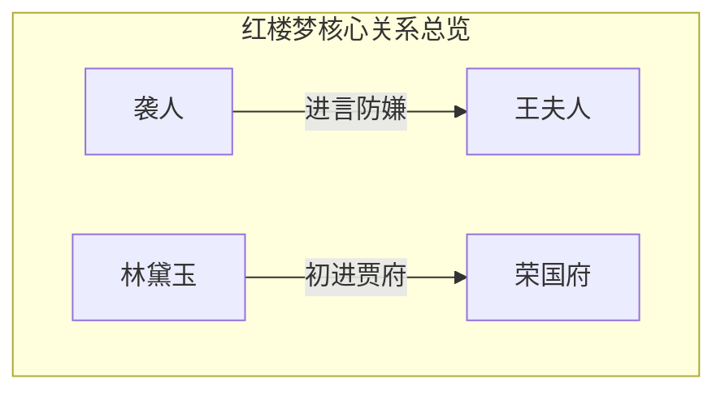

# 综合报告：全局人物与概念关系拓扑网络

> 由 LLM Wiki Mermaid 关系网引擎自动编织维护，支持增量去重与多维关联拓扑。

## 📊 抽取三元组详情清单

| 主体 (Source) | 关系属性 (Relation) | 客体 (Target) | 章节出处 (Context) |
| :--- | :--- | :--- | :--- |
| [[袭人]] | 进言防嫌 | [[王夫人]] | 第5回 |
| [[林黛玉]] | 初进贾府 | [[荣国府]] | 第5回 |