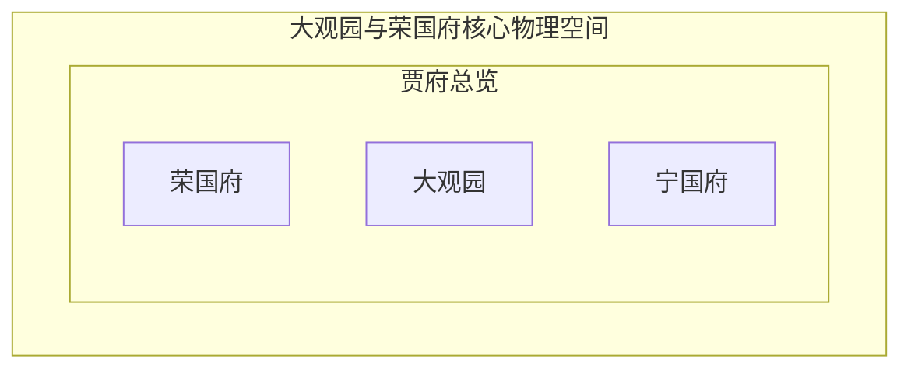

# 空间架构与场景移动轨迹解构

> 由 LLM Wiki 空间场景解构引擎（Spatial Mapping Enricher）自动生成与维护。

## 📍 核心场景建筑索引清单

| 空间建筑名称 | 所属宏观区域 | 建筑形制与场景功能特征 |
| :--- | :--- | :--- |

---

## 🚶 人物场景移动轨迹记录

| 角色 | 出发空间 (From) | 抵达空间 (To) | 章回背景 (Context) |
| :--- | :--- | :--- | :--- |